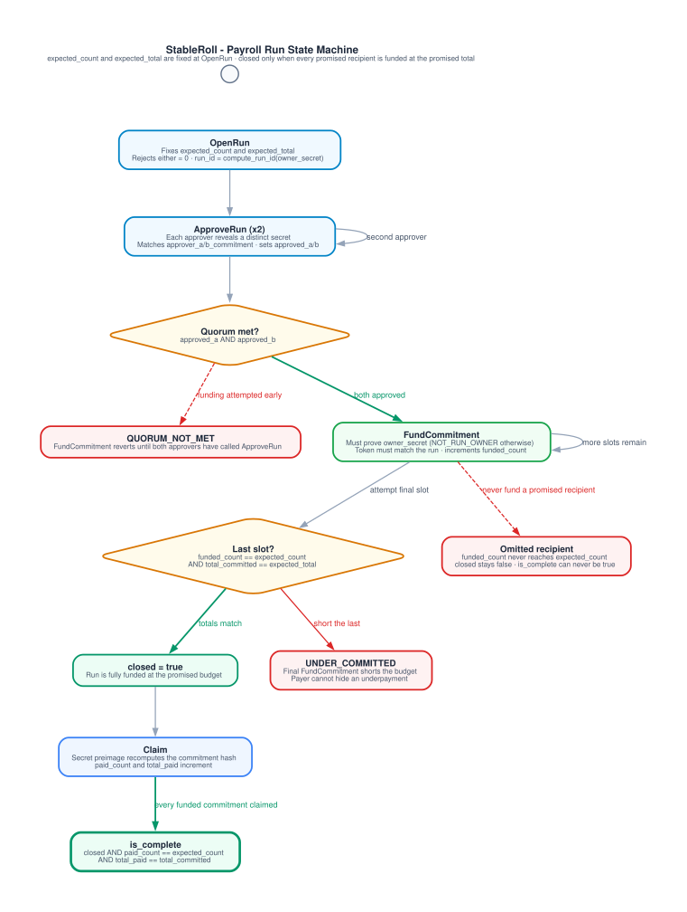
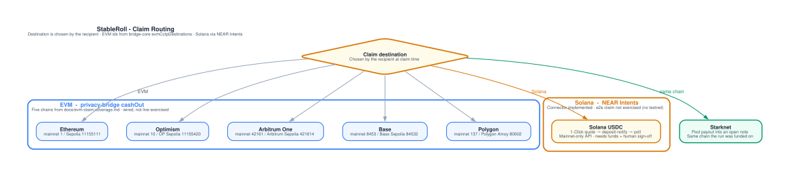

# Architecture diagrams

These diagrams are generated from typed specs in `diagrams/definitions/`.
Do not edit `diagrams/out/*.dot` or `diagrams/out/*.svg` by hand. Change the
matching `*.diagram.ts` file and run:

```bash
brew install graphviz    # or: apt-get install graphviz
cd diagrams
npm ci
npm run generate
```

CI regenerates from source and fails the PR if a committed `.dot` file
drifted. SVG layout numbers depend on the Graphviz version (Homebrew vs
Ubuntu apt), so the required drift check is the DOT, which this repo fully
controls. The committed SVGs are the render used by this document and the
README.

## System architecture


A payer funds through the STRK20 privacy pool. The pool's `InvokeExternal`
is the only caller of `Payroll.privacy_invoke`. `RunInfo` stores aggregate
accounting and an `owner_commitment` derived from the payer's `owner_secret`
(see `docs/adr-run-ownership.md`). It stores no payer address: the pool is
always the caller, and recording the real payer would publish the link the
pool exists to hide.

Claim legs as they exist in this repo today:

- Starknet: pool payout.
- EVM: privacy-bridge `cashOut`, wired against the real API. Not yet
  exercised against live testnet infrastructure. Chain list in
  `docs/evm-claim-coverage.md`.
- Solana: NEAR Intents 1-Click connector in
  `integration/src/near-intents-connector.ts`. Route verified live via
  `npm run test:liquidity`. The end-to-end claim is not exercised (NEAR
  Intents has no testnet; mainnet needs funds and human sign-off). See
  `docs/solana-claim-coverage.md`.

## Run state machine



Invariants copied from `contracts/payroll/src/payroll.cairo`, not restated
from memory:

- `expected_count` and `expected_total` are fixed at `OpenRun`. Either set
  to zero is rejected (`expected_count == 0` is how "run does not exist" is
  encoded).
- `closed` is set only when `funded_count == expected_count` **and**
  `total_committed == expected_total`. A short final `FundCommitment`
  reverts `UNDER_COMMITTED`.
- A payer who omits a recipient never reaches
  `funded_count == expected_count`, so `closed` stays false and
  `is_complete` can never return true, even after every commitment they did
  fund is claimed.
- `is_complete` = `closed && paid_count == expected_count && total_paid == total_committed`.
- `Claim` recomputes the commitment hash from the revealed secret. The
  caller does not pass `commitment_hash`.

## Claim routing



EVM destinations are the five chains in `docs/evm-claim-coverage.md`'s
table, with those exact mainnet and testnet chain ids. Do not add a chain
to this diagram without re-reading that file.

| Chain | Mainnet chain id | Testnet (chain id) |
|---|---|---|
| Ethereum | 1 | Ethereum Sepolia (11155111) |
| Optimism | 10 | OP Sepolia (11155420) |
| Arbitrum One | 42161 | Arbitrum Sepolia (421614) |
| Base | 8453 | Base Sepolia (84532) |
| Polygon | 137 | Polygon Amoy (80002) |
