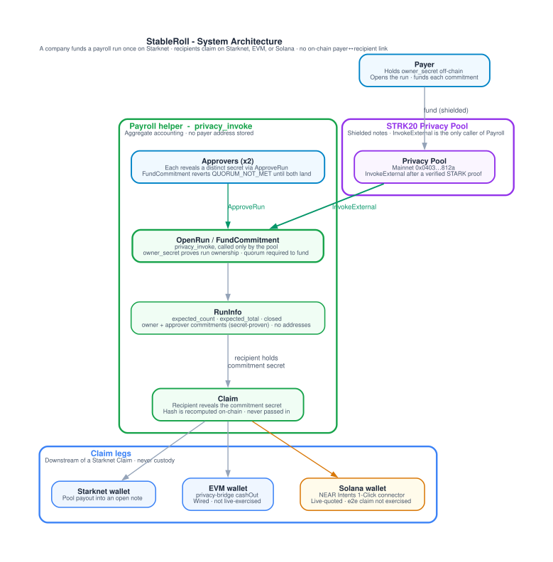

# StableRoll

Cross-chain private payroll on Starknet. A company funds a payroll run once,
on Starknet, using the [STRK20 privacy pool][strk20-pool]. Recipients claim
into a wallet on Starknet, an EVM chain, or Solana, with no on-chain link
between payer and recipient, and no centralized service holding the payment
list.

Built for the **STRK20 Private Sprint** (Starknet, 14–31 Aug 2026).


## Why payroll needs privacy

A payroll run funded and claimed in the open on a public ledger leaks a
company's entire headcount, compensation bands, and org structure to anyone
watching the chain. StableRoll routes funding and claiming through the STRK20
privacy pool so the run's existence and its aggregate numbers are public (so
recipients and auditors can verify the run is fully funded), but which
recipient got which payment is not.

## What is and isn't private

Do not read this as "fully private". An on-chain observer of the Payroll
contract and the pool can still see real information:

| Visible to any on-chain observer | Never visible on-chain |
|---|---|
| That a payroll run exists (`run_id`) | Which recipient corresponds to which commitment |
| The run's `expected_count` and `expected_total` | The amount a specific identity was paid |
| Running totals: `funded_count`, `paid_count`, `total_committed`, `total_paid` | The link between the payer and the run (the pool is always the caller; `RunInfo` stores no payer address) |
| That a given commitment was claimed, and the claim transaction itself | Which claim transaction belongs to which commitment/recipient, beyond what the commitment hash itself reveals |
| The token used and whether the run is `closed` | Recipient identities across claims (no address reuse is required, and none is enforced) |

The completeness guarantee (`is_complete`) is a public, verifiable property —
that a run was funded exactly as promised and every promised recipient was
paid — without revealing who those recipients are.

## What actually works today

This repo is mid-build. Only claim the chains and legs that are real:

| Component | Status |
|---|---|
| `contracts/payroll` — Cairo contract, `privacy_invoke`-driven run accounting, run-ownership authorization | Done — tested (`snforge test`, CI-enforced) |
| Starknet → Starknet fund + claim, via the pool | Done and tested locally. Not yet exercised against live Sepolia or mainnet infrastructure |
| EVM claim leg (privacy-bridge) | Wired against the real API (`cashOut`, see `docs/evm-claim-coverage.md`). Not yet exercised against live testnet infrastructure |
| Solana claim leg (NEAR Intents) | Connector implemented against the real 1-Click API (see `docs/solana-claim-coverage.md`). Route verified live — pinned asset IDs and a dry-run quote are re-checked by `npm run test:liquidity`. The end-to-end claim is **not** exercised: NEAR Intents has no testnet, so it needs mainnet funds and human sign-off |
| Waku recipient notification | Done and tested end-to-end against the live Waku test fleet (`notify/`) — not yet wired to `FundCommitment` |
| Cavos payer/recipient UX | Planned — not implemented yet |
| Mainnet eligibility transactions | Not yet recorded — `strk20.json`'s `transactions` array is currently empty |

Check the repo's GitHub issues for what's actively in progress; treat that
tracker, not this README, as the up-to-date source of truth on scope.

## Architecture



Generated from `diagrams/definitions/`, not drawn by hand. The ASCII diagram
this replaced had already drifted (it omitted run ownership and still labelled
the EVM and Solana legs "planned"). Do not edit the SVG; change the typed
spec and run `npm run generate` in `diagrams/`. The run state machine and
claim-routing tree live in [`ARCHITECTURE.md`](ARCHITECTURE.md).

- **`contracts/payroll`** — the only component that ever touches recipient
  funds. Called exclusively by the privacy pool's `InvokeExternal`; see
  `CLAUDE.md` §6 for the accounting invariants it enforces (fixed
  `expected_count`/`expected_total`, exact-final-commitment closing, run
  ownership proven by secret rather than address).
- **`integration`** — TypeScript tests and helpers driving the pool +
  Payroll contract via the privacy SDK.
- **`notify`** — Waku ECIES key/topic derivation and encrypted claim
  notifications, keyed off the same commitment secret as the on-chain claim,
  never a Starknet address (see the package's `topics.ts`). Not yet called
  from anywhere else in the repo.
- **`integration/src/near-intents-connector.ts`** — the Solana claim leg:
  quote → deposit-notify → poll, against NEAR Intents' 1-Click API. It sits
  downstream of a Starknet claim and never touches custody or the
  privacy-critical accounting above.
- The Cavos UX layer is a separate, not-yet-built component.

## Dependency transparency

| Dependency | Role | License |
|---|---|---|
| [STRK20 Privacy Pool][strk20-pool], Escrow pattern, Privacy Bridge | Core privacy primitive this repo builds on (StarkWare) | Apache-2.0 |
| [Cavos](https://github.com/cavos-labs) | Starknet-side payer/recipient UX only — never custody, never a cross-chain leg | Most Cavos repositories carry **no declared license**; only `docs` and `cavos-account` are MIT. Treat the rest as all-rights-reserved until StarkWare/Cavos states otherwise. |
| [Waku](https://waku.org) | Recipient notification transport only — no custody, no privacy-critical logic depends on it | Apache-2.0 / MIT (dual, per Waku project) |

## Local setup

Requires [asdf](https://asdf-vm.com) with the `scarb` and `starknet-foundry`
plugins.

```bash
asdf install   # reads .tool-versions: scarb 2.17.0, starknet-foundry 0.63.0
```

### Cairo — no credentials needed

```bash
cd contracts/payroll
scarb build
snforge test
```

### TypeScript — tokenless path (no credentials needed)

```bash
cd integration
npm install
npm run test:offline
```

### Notify — Waku recipient notifications

```bash
cd notify
npm install
npm run test:offline   # deterministic derivation tests, no network
npm test               # full suite — talks to the live Waku test fleet, no credentials needed
```

### Diagrams: regenerate the committed SVGs

Requires [Graphviz](https://graphviz.org) (`dot` on `PATH`). It is a local
and CI dependency, not pinned in `.tool-versions`.

```bash
brew install graphviz          # macOS
# apt-get install graphviz     # Debian/Ubuntu
cd diagrams
npm ci
npm run generate               # writes diagrams/out/<name>.{dot,svg}
```

CI fails the PR if a typed spec changed without regenerating the committed
`.dot` files. See [`ARCHITECTURE.md`](ARCHITECTURE.md).

### TypeScript — full suite (needs a GitHub Packages token)

`@starkware-libs/starknet-privacy-sdk` ships on GitHub Packages and is
declared as an `optionalDependency` specifically so `npm install` succeeds
without a token — only the SDK-dependent tests are skipped/fail without one.

```bash
npm config set //npm.pkg.github.com/:_authToken <TOKEN>   # needs read:packages
cd integration
npm test
```

CI (`.github/workflows/ci.yml`) runs only the tokenless path on every PR, by
design — see `CLAUDE.md` §8.

If you hit a build/toolchain error, check `CLAUDE.md` §3 first — its
error-to-cause map covers every trap this repo's toolchain has actually
produced, and the fix is almost never what the error text suggests.

## Mainnet contracts and transactions

Recorded in [`strk20.json`](strk20.json). Once at least 3 mainnet
eligibility transactions are banked, each will be explained in
`docs/mainnet-eligibility.md` (linked here once that file exists).

## License

Apache-2.0 — see [`LICENSE`](LICENSE), matching the reference contracts this
project extends.

---

For contributor and toolchain context (pinned versions, the full
error-to-cause map, and the rules this repo is built under), read
[`CLAUDE.md`](CLAUDE.md) before opening a PR.

[strk20-pool]: https://voyager.online/contract/0x040337b1af3c663e86e333bab5a4b28da8d4652a15a69beee2b677776ffe812a
